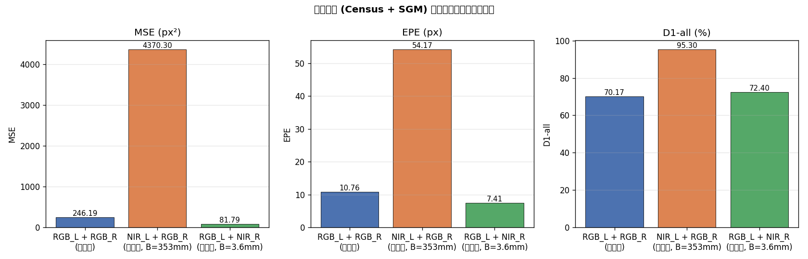
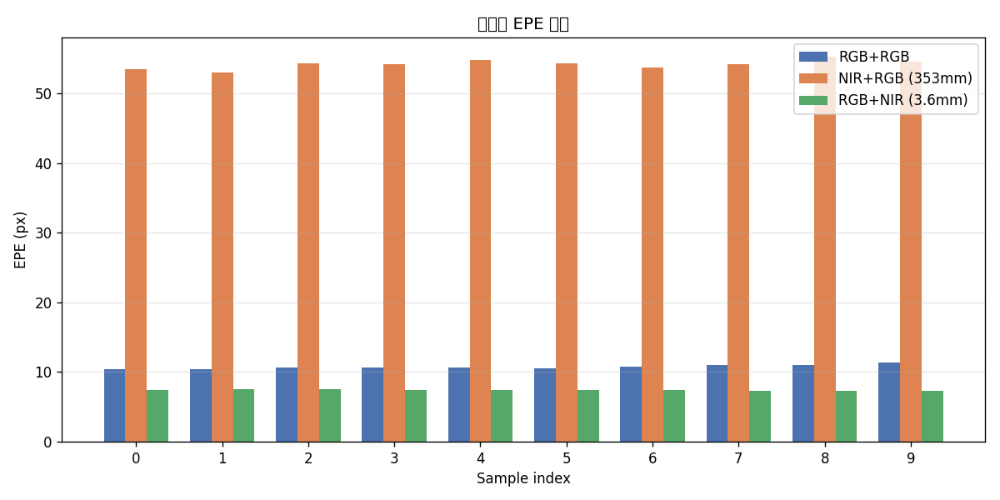
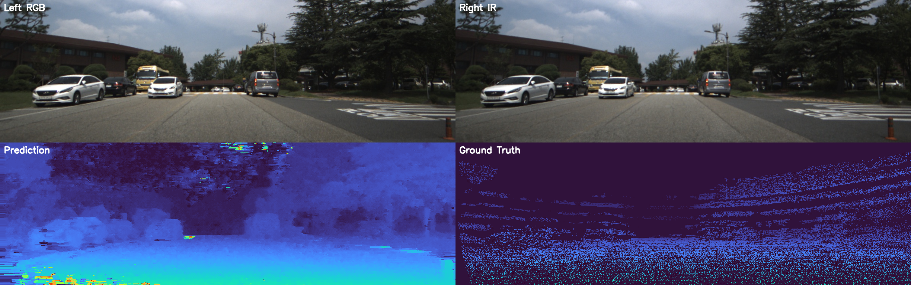
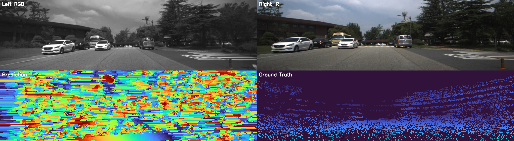
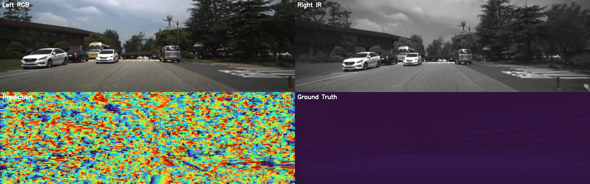
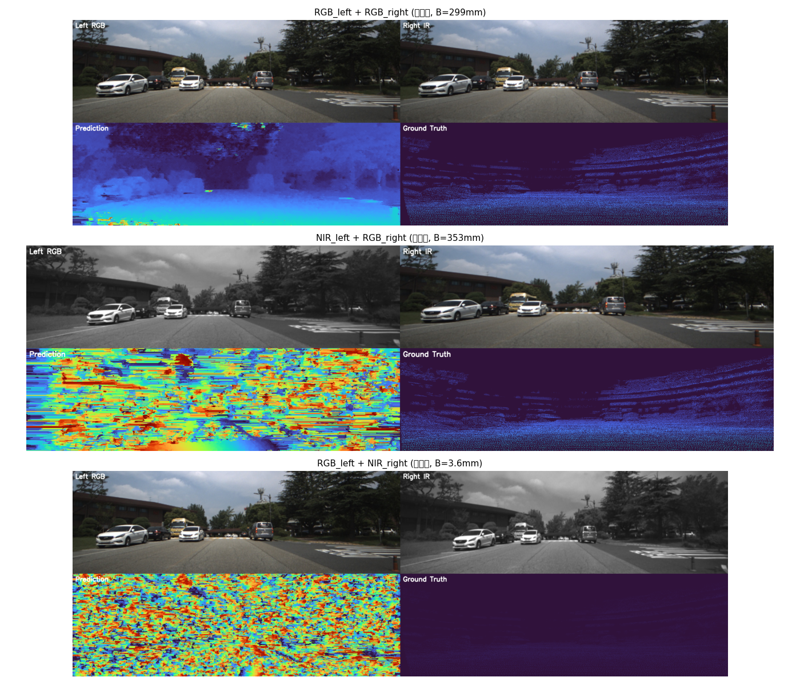

# 跨模态立体匹配实验报告 — 传统方法 (Census + SGM)

## 一、实验目的

验证传统立体匹配方法（Census 变换 + SGM 半全局匹配）在以下三种立体对配置下的匹配效果：

1. **同模态基线**：RGB 左图 + RGB 右图
2. **跨模态配对 A**：NIR 左图 + RGB 右图（近红外参考 + 可见光匹配）
3. **跨模态配对 B**：RGB 左图 + NIR 右图（可见光参考 + 近红外匹配）

## 二、数据集与相机配置

数据集：MS2 Multi-Spectral Stereo Dataset，序列 `_2021-08-06-10-59-33`

### 相机几何参数

| 配对 | 参考相机 | 匹配相机 | 基线 (mm) | 参考焦距 (px) | GT 深度视角 |
|------|----------|----------|-----------|---------------|-------------|
| RGB_L + RGB_R | RGB 左 (384×1224) | RGB 右 (384×1224) | 299.2 | 764.5 | RGB 左 |
| NIR_L + RGB_R | NIR 左 (352×1280) | RGB 右 (384×1224) | 352.9 | 638.9 | NIR 左 |
| RGB_L + NIR_R | RGB 左 (384×1224) | NIR 右 (352×1280) | 3.6 | 764.5 | RGB 左 |

### 关键观察

- **NIR_L + RGB_R** 的基线（353mm）甚至大于同模态 RGB 对（299mm），具有充足的视差范围，是**有效的跨模态立体对**
- **RGB_L + NIR_R** 的基线仅 3.6mm，最大视差 < 1 像素，**几何上不适合立体匹配**，但仍可作为对照实验

### 图像分辨率处理

当左右图像分辨率不一致时（如 NIR 352×1280 vs RGB 384×1224），预处理器自动将右图双线性插值到与左图相同尺寸。

## 三、算法配置

所有实验使用相同的传统方法流水线：

| 模块 | 方法 | 参数 |
|------|------|------|
| 预处理 | 灰度转换 + CLAHE | clip=4, tile=8 |
| 特征提取 | Census 9×9 变换 | 80 位描述子 |
| 匹配代价 | Hamming 距离 | — |
| 代价聚合 | SGM 8 方向 | P1=10, P2=120 |
| 视差估计 | WTA + 亚像素精化 | — |
| 后处理 | 左右一致性检查 + 空洞填充 | lr_threshold=1.0 |

各配对的 `max_disparity` 设置：
- RGB_L + RGB_R：128
- NIR_L + RGB_R：128
- RGB_L + NIR_R：16（因基线极小）

## 四、定量评估结果

在 10 张测试图上的平均指标：

| 配对 | MSE (px²) | EPE (px) | D1-all (%) | 有效像素数 |
|------|-----------|----------|------------|------------|
| **RGB_L + RGB_R（同模态）** | 246.19 | 10.76 | 70.17 | ~350k |
| **NIR_L + RGB_R（跨模态）** | 4370.30 | 54.17 | 95.30 | ~114k |
| **RGB_L + NIR_R（跨模态）** | 81.79 | 7.41 | 72.40 | ~178k |

### 指标对比图



### 逐样本 EPE 对比



## 五、结果分析

### 5.1 NIR_L + RGB_R（基线 353mm）— 跨模态匹配严重失败

- **EPE = 54.17 px**，是同模态的 **5 倍**
- **D1-all = 95.3%**，几乎所有像素都是错误匹配
- **原因**：Census 变换依赖局部灰度排序关系。RGB 和 NIR 图像的灰度分布差异极大（植被在 NIR 中高亮、天空在 NIR 中暗），导致 Census 比特串完全不同，Hamming 距离失去区分能力
- **结论**：传统 Census + SGM 方法**无法有效处理跨模态匹配**

### 5.2 RGB_L + NIR_R（基线 3.6mm）— 低 EPE 但无意义

- **EPE = 7.41 px** 看似较低，但这是因为：
  - 真实视差 < 1 px（基线太小），GT 视差接近 0
  - 算法输出的视差也接近 0（因为搜索范围内所有代价都差不多）
  - 误差 = |预测 ≈ 0 − GT ≈ 0| ≈ 小值
- **D1-all = 72.4%** 仍然很高，说明即使视差范围极小，跨模态特征差异仍导致大量错配
- **结论**：此配对**几何上不可行**，不适合做立体匹配

### 5.3 同模态 RGB_L + RGB_R — 合理基线

- **EPE = 10.76 px**，Census 在同模态下表现正常
- **D1-all = 70.17%**，约 30% 像素匹配正确（3px 阈值内）
- 这是传统方法在该数据集上的合理水平

## 六、定性可视化

### 样本 000000 — 同模态 (RGB_L + RGB_R)



### 样本 000000 — 跨模态 (NIR_L + RGB_R)



### 样本 000000 — 跨模态 (RGB_L + NIR_R)



### 三种配对对比



### 可视化观察

1. **同模态**：视差图结构清晰，近景物体（车辆、树木）边界可辨，远景有空洞但整体合理
2. **NIR_L + RGB_R**：视差图几乎全是噪声，无法辨认场景结构，Census 特征在跨模态下完全失效
3. **RGB_L + NIR_R**：视差图接近全零（因基线极小），无深度信息

## 七、实验结论

| 结论 | 说明 |
|------|------|
| ✅ 程序支持跨模态匹配 | 通过 `--mode nir_rgb` 或 `--mode rgb_nir` 生成清单即可切换 |
| ❌ Census 不适合跨模态 | RGB/NIR 灰度分布差异导致 Census 描述子完全不匹配 |
| ⚠️ RGB_L + NIR_R 基线太小 | 3.6mm 基线无法产生有意义的视差 |
| ✅ NIR_L + RGB_R 几何可行 | 353mm 基线充足，但需要模态不变特征（如 Siamese CNN） |

### 改进方向

传统 Census 方法在跨模态场景下失效的根本原因是：**Census 变换假设同一场景点在左右图中具有相似的局部灰度排序**，而 RGB 与 NIR 的光谱响应差异打破了这一假设。

解决方案：
1. **深度学习特征**：训练 Siamese CNN 学习模态不变表征（本项目已实现）
2. **梯度域匹配**：使用梯度方向而非灰度值（对光度变化更鲁棒，但仍有限）
3. **互信息代价**：MI (Mutual Information) 不依赖灰度一致性假设

## 八、复现命令

```bash
cd cross-modal-stereo-matching

# 生成三种清单
python3 scripts/generate_manifest.py --data-root data/MS2 --output data/MS2/manifest_rgb_eval.csv     --mode rgb     --max-samples 10
python3 scripts/generate_manifest.py --data-root data/MS2 --output data/MS2/manifest_nir_rgb_eval.csv --mode nir_rgb --max-samples 10
python3 scripts/generate_manifest.py --data-root data/MS2 --output data/MS2/manifest_rgb_nir.csv      --mode rgb_nir --max-samples 10

# 运行三种配对
./build/bin/cms run --config configs/default.yaml --manifest data/MS2/manifest_rgb_eval.csv     --output-dir output/exp_rgb
./build/bin/cms run --config configs/nir_rgb.yaml --manifest data/MS2/manifest_nir_rgb_eval.csv --output-dir output/exp_nir_rgb
./build/bin/cms run --config configs/rgb_nir.yaml --manifest data/MS2/manifest_rgb_nir.csv      --output-dir output/exp_rgb_nir

# 评估
./build/bin/cms evaluate --config configs/default.yaml --manifest data/MS2/manifest_rgb_eval.csv     --pred-dir output/exp_rgb     --csv output/exp_rgb/metrics.csv
./build/bin/cms evaluate --config configs/nir_rgb.yaml --manifest data/MS2/manifest_nir_rgb_eval.csv --pred-dir output/exp_nir_rgb --csv output/exp_nir_rgb/metrics.csv
./build/bin/cms evaluate --config configs/rgb_nir.yaml --manifest data/MS2/manifest_rgb_nir.csv      --pred-dir output/exp_rgb_nir --csv output/exp_rgb_nir/metrics.csv

# 可视化
./build/bin/cms visualize --config configs/default.yaml --manifest data/MS2/manifest_rgb_eval.csv     --pred-dir output/exp_rgb     --output-dir output/exp_rgb/viz
./build/bin/cms visualize --config configs/nir_rgb.yaml --manifest data/MS2/manifest_nir_rgb_eval.csv --pred-dir output/exp_nir_rgb --output-dir output/exp_nir_rgb/viz
./build/bin/cms visualize --config configs/rgb_nir.yaml --manifest data/MS2/manifest_rgb_nir.csv      --pred-dir output/exp_rgb_nir --output-dir output/exp_rgb_nir/viz
```
