# Project 5 — 跨模态立体匹配实验报告
小组成员：崔天昱（2451783） 李云扬（2451394）
> **摘要**：本实验围绕 RGB 与近红外（NIR/IR）跨模态立体匹配问题，在 MS2 多光谱立体数据集上对比验证了三种方案：传统 Census + SGM 基线、基于 Siamese ResNet18 的学习型特征替换 Census 后再接入 SGM 的混合方案，以及受 arXiv:2411.03638 启发设计的 CFM 端到端深度学习流水线。实验结果表明，传统 Census + SGM 在跨模态场景下几乎完全失效（EPE ≈ 55 px，D1-all ≈ 95%）。Siamese ResNet18 虽在训练集上损失持续下降，但在验证集推理中暴露出边缘断裂、语义混淆与泛化性差等问题，最终被我们小组放弃。受到 arXiv:2411.03638 的启发，我们将该论文提出的 CFM Pipeline 作为后续重点探索方向，并在原神经网络的基础上进行了适当的改进，最终在 50 epoch 内实现损失下降 94%，达到了较为不错的训练效果。本文以样本 **008004_4** 为典型案例，从训练损失、定量指标与定性可视化三个维度展开详细分析，并深入探讨不同方法表现差异的成因。本项目的源代码已开源在 Github 中，仓库链接为https://github.com/tjcty20051110/Cross-modal-Stereo-Matching

---

## 一、引言与背景

立体匹配（Stereo Matching）是计算机视觉中获取场景三维结构的核心技术，其目标是在已校正的左右视图之间建立逐像素的对应关系，进而通过三角测量恢复深度。传统方法通常假设左右图像具有相同或相似的成像模态（如 RGB-RGB），因此在特征提取与代价度量环节依赖灰度或颜色的一致性假设。

然而，在夜间、烟雾、强光照变化等复杂环境下，单一模态难以同时保证鲁棒性与信息完备性。RGB 图像富含纹理与颜色细节，但在低光照条件下信噪比急剧下降；近红外（NIR）或红外（IR）图像对温度差异敏感，可在无光照条件下稳定成像，但缺乏颜色与精细纹理。二者具有天然的互补特性，因此 RGB-NIR 跨模态立体匹配在自动驾驶夜视、安防监控与应急救援等场景中具有重要价值。

跨模态匹配的核心挑战在于 **模态间外观差异**：RGB 与 NIR 图像的光谱响应函数截然不同，导致同一场景点在两种模态下的灰度分布、边缘位置与纹理对比度均不一致。传统基于灰度一致性的代价度量（如 AD、SAD、NCC、Census Hamming）在此场景下失去判别力。如何构造 **模态不变的特征表示**、设计 **鲁棒的跨模态代价函数**，并保持 **边缘与深度结构的几何一致性**，成为本实验的核心研究问题。

本实验基于 **MS2 Multi-Spectral Stereo Dataset**，重点对比以下三种方案：

| 方案 | 特征提取 | 代价聚合 | 视差估计 | 说明 |
|------|---------|---------|---------|------|
| **传统基线** | Census 9×9（手工特征） | SGM 8 方向 | WTA + 亚像素 | 验证跨模态下传统方法极限 |
| **Siamese ResNet18 + SGM** | ResNet18 孪生网络（32 维嵌入） | SGM 8 方向 | WTA + 亚像素 | 学习模态不变特征，保留 SGM 全局约束 |
| **CFM Pipeline** | 双分支 CNN + Cross Attention | 逐像素 Gaussian 深度分布 | 直接回归深度 | 端到端深度估计，参考 arXiv:2411.03638 |

---

## 二、实验环境与数据集

### 2.1 硬件与软件环境

| 项目 | 配置 |
|------|------|
| GPU | NVIDIA GeForce RTX 4060 Laptop (8 GB VRAM) |
| CUDA | 12.1 |
| LibTorch | 2.4.0+cu121 |
| 操作系统 | Ubuntu 22.04 LTS |
| 编译器 | GCC 12.3，C++17 标准 |
| 核心依赖 | OpenCV 4.9.0, yaml-cpp, GoogleTest |

### 2.2 数据集配置

MS2 数据集包含同步采集的 RGB 与 NIR 图像，以及由 LiDAR 投影生成的稀疏深度真值。

| 参数 | 值 |
|------|-----|
| 参考图像 | NIR 左图 (352×1280) |
| 匹配图像 | RGB 右图 (384×1224) |
| 基线 (baseline) | 352.9 mm |
| 参考焦距 (focal) | 638.9 px |
| GT 深度 | `proj_depth/nir/depth_filtered/`，uint16 PNG，换算 `depth_m = pixel / 256` |
| 最大视差 | 128 px |
| 训练集 | 200 张 (manifest_nir_rgb_train.csv) |
| 验证集 | 20 张，索引 8000–8019 (manifest_nir_rgb_val.csv) |

> **预处理**：当左右分辨率不一致时，右图通过双线性插值缩放至左图尺寸；随后执行灰度化与 CLAHE 对比度增强（clip=4, tile=8）。

---

## 三、传统方法：Census 变换 + SGM

### 3.1 算法原理

传统流水线采用 **Census 变换** 进行局部特征编码，**半全局匹配（SGM）** 进行代价聚合，最后通过 **Winner-Takes-All（WTA）** 选取最优视差。

**Census 变换**：对于每个像素 $(x, y)$，以其灰度值 $I(x, y)$ 为中心，在 $w \times w$ 邻域内（本实验 $w=9$）逐像素比较灰度大小关系，生成一个长度为 $w^2-1=80$ 的二值描述子：

$$
\text{Census}(x, y) = \bigotimes_{\substack{i,j=-r \\ (i,j)\neq(0,0)}}^{r} \xi\bigl(I(x,y), I(x+i, y+j)\bigr)
$$

其中 $\xi(a, b) = 1$ 若 $b > a$，否则为 $0$，$r = w/2$。该描述子对局部光照变化具有不变性，但**严重依赖灰度排序关系**——这正是其在 RGB-NIR 跨模态场景下失效的根本原因。

**匹配代价**：左右图对应像素的 Census 描述子通过 **Hamming 距离** 计算相似度：

$$
C(x, y, d) = \text{Hamming}\bigl(\text{Census}_L(x, y), \text{Census}_R(x-d, y)\bigr)
$$

**SGM 代价聚合**：在 8 个方向上逐路径最小化能量函数：

$$
E(D) = \sum_{p} C(p, D_p) + \sum_{q \in N_p} P_1 \cdot [|D_p - D_q| = 1] + \sum_{q \in N_p} P_2 \cdot [|D_p - D_q| > 1]
$$

其中 $P_1=10$ 惩罚微小视差跳变，$P_2=120$ 惩罚过大跳变（通常由遮挡引起）。

### 3.2 计算流程与伪代码

```
Algorithm 1: Census + SGM Stereo Matching
─────────────────────────────────────────
Input : Left image IL, Right image IR, max_disparity Dmax
Output: Disparity map D, validity mask M

1.  PREPROCESS(IL, IR)
2.      IL_gray ← GRAYSCALE(IL)
3.      IR_gray ← GRAYSCALE(IR)
4.      IL_clahe ← CLAHE(IL_gray, clip=4, tile=8×8)
5.      IR_clahe ← CLAHE(IR_gray, clip=4, tile=8×8)
6.
7.  FEATURE_EXTRACT(image)
8.      For each pixel (x, y):
9.          center ← image[y, x]
10.         bits ← empty list
11.         For dy = -4 to 4:
12.             For dx = -4 to 4:
13.                 If (dx, dy) == (0, 0): continue
14.                 neighbor ← image[y+dy, x+dx]  (clamped)
15.                 bits.append( neighbor > center ? 1 : 0 )
16.         Return 80-bit descriptor
17.
18. FEAT_L ← FEATURE_EXTRACT(IL_clahe)
19. FEAT_R ← FEATURE_EXTRACT(IR_clahe)
20.
21. BUILD_COST_VOLUME(FEAT_L, FEAT_R, Dmax)
22.     For each (x, y, d):
23.         xr ← x - d
24.         If xr < 0: cost[y, x, d] ← INVALID
25.         Else: cost[y, x, d] ← HAMMING(FEAT_L[y,x], FEAT_R[y,xr])
26.
27. SGM_AGGREGATE(cost, directions=8, P1=10, P2=120)
28.     For each direction r in {0°, 45°, 90°, ..., 315°}:
29.         L_r[y, x, d] ← cost[y, x, d] + min(
30.             L_r[y−Δy, x−Δx, d],
31.             L_r[y−Δy, x−Δx, d−1] + P1,
32.             L_r[y−Δy, x−Δx, d+1] + P1,
33.             min_k L_r[y−Δy, x−Δx, k] + P2
34.         ) − min_k L_r[y−Δy, x−Δx, k]
35.
36. WTA_DISPARITY(aggregated_cost)
37.     D[y, x] ← argmin_d aggregated_cost[y, x, d]
38.
39. SUBPIXEL_REFINE(D, aggregated_cost)  // parabolic fit
40.
41. LEFT_RIGHT_CONSISTENCY(D, D_right, threshold=1.0)
42.     M ← mark pixels where |D[y,x] − D_right[y, x−D[y,x]]| ≤ threshold
43.
44. HOLE_FILLING(D, M)
45.     For invalid pixels: interpolate from 16 nearest valid neighbors
46.
47. Return D, M
```

### 3.3 跨模态实验效果观察

下图以样本 **008004_4** 为例，直观对比 Census + SGM 与 Siamese ResNet18 + SGM 在跨模态（NIR + RGB）场景下的预测视差。

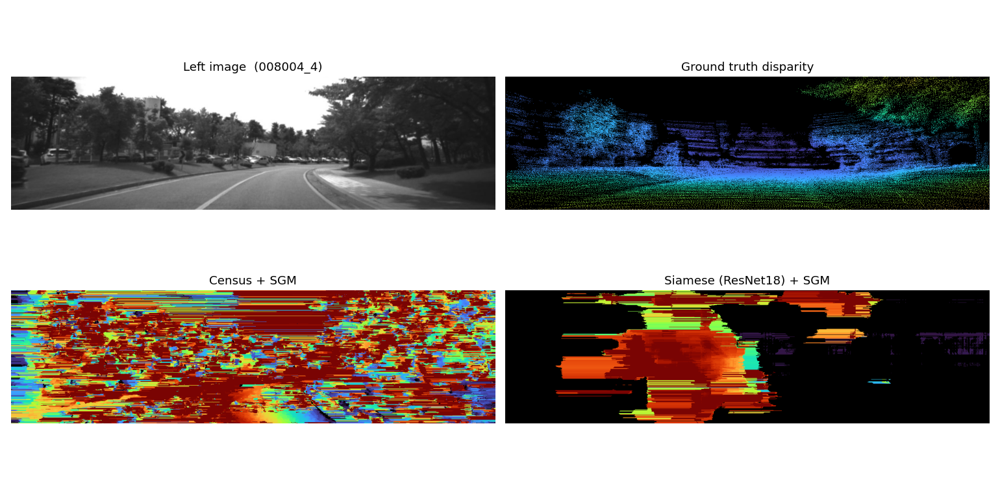

**左上：Left image（NIR）** — 参考图像；**右上：Ground truth** — 稀疏 LiDAR 投影的真值视差。

**左下：Census + SGM** — 视差图充满水平条纹与彩色斑块噪声，完全无法辨认道路、树木或天空的层次结构。同一场景点在 RGB 与 NIR 下的 Census 描述子完全不同，导致 Hamming 距离失去判别力；SGM 的全局平滑约束无法从完全随机的局部代价中恢复出正确的视差结构，最终输出接近纯噪声。

**右下：Siamese ResNet18 + SGM** — 作为对比，学习型特征已能分辨出路面、树木与天空的大致深度层次。尽管该方案最终因边缘断裂与泛化性问题被团队放弃（详见 4.4 节），但其与 Census 的对比充分证明：跨模态立体匹配的核心瓶颈在于**特征表示**，而非聚合策略。

### 3.4 跨模态失效机理分析

Census 变换的核心假设是：**同一场景点在左右视图中的局部灰度排序一致**。在 RGB-NIR 跨模态场景下，该假设被彻底打破：

- **植被**：在 NIR 波段因叶绿素强反射而高亮，在 RGB 中呈深绿色，灰度排序完全反转；
- **天空/路面**：在 RGB 中亮度较高，在 NIR 中因缺乏热辐射而暗淡；
- **阴影区域**：RGB 中阴影导致灰度骤降，NIR 对光照不敏感，阴影边界模糊或消失。

上述差异导致左右 Census 描述子的汉明距离近乎随机，代价体失去区分度。SGM 的全局平滑约束无法从完全随机的局部代价中恢复出正确的视差结构，最终输出接近噪声。

---

## 四、深度学习方法：Siamese ResNet18 + SGM

鉴于传统手工特征在跨模态场景下的根本性缺陷，本实验引入 **Siamese ResNet18 卷积神经网络**，通过学习模态不变的稠密特征嵌入（modality-invariant embedding），替换 Census 描述子后接入原有 SGM 流水线。该方案保留了 SGM 的全局一致性约束，同时利用深度网络的表达能力克服模态差异。

### 4.1 网络架构

Siamese ResNet18 为左右视图共享权重的双分支网络，输入单通道灰度图，输出 32 维 L2 归一化特征图。

```
Input  [B, 1, H, W]                                   // 单通道灰度图
├── Stem:      Conv 1→32,  3×3, stride=1, BN, ReLU
├── Stage1:    2 × BasicBlock(32→32,  stride=1, dilation=1)   // H × W
├── Stage2:    2 × BasicBlock(32→64,  stride=2, dilation=1)   // H/2 × W/2
├── Stage3:    2 × BasicBlock(64→128, stride=1, dilation=2)   // H/2 × W/2
├── Stage4:    2 × BasicBlock(128→128,stride=1, dilation=4)   // H/2 × W/2
├── Head:      Conv 128→32, 1×1
├── Upsample:  Bilinear interpolation → H × W
└── L2 Normalize along channel dim (p=2, dim=1)
Output [B, 32, H, W]
```

**关键设计**：
- **膨胀卷积（Dilated Conv）**：Stage3 与 Stage4 分别引入 dilation=2 与 dilation=4，在不增加下采样率的前提下将有效感受野扩展至约 63 像素，足以覆盖跨模态匹配所需的上下文；
- **Stage2 单步下采样**：仅在此处将分辨率减半，以控制 384×1224 输入下的显存占用；
- **双线性上采样 + L2 归一化**：特征图恢复至全分辨率，L2 归一化使得余弦相似度退化为点积，直接用于代价体构建。

### 4.2 训练流程与伪代码

训练采用 **Triplet Margin Loss**，从 GT 视差中采样三元组（anchor, positive, negative）约束特征空间：

$$
\mathcal{L} = \sum_{i} \max\bigl(0, \, d(f_a, f_p) - d(f_a, f_n) + \text{margin}\bigr)
$$

其中 $d(\cdot, \cdot)$ 为欧氏距离，margin = 0.2。anchor 为左图特征，positive 为右图对应匹配点特征，negative 为右图随机偏移点特征。

```
Algorithm 2: Siamese ResNet18 Training
──────────────────────────────────────
Input : Training manifest M, epochs E, samples_per_image N=256
Output: Trained model weights θ

1.  INITIALIZE(SiameseNetwork())
2.  optimizer ← Adam(lr=0.001, β=(0.9, 0.999))
3.  device ← CUDA if available else CPU
4.
5.  For epoch = 1 to E:
6.      total_loss ← 0
7.      For each batch in DataLoader(M, batch_size=1 image):
8.          IL, IR, GT_disp, mask ← LOAD_BATCH(batch)
9.          IL_t ← IMAGE_TO_TENSOR(PREPROCESS(IL)).to(device)
10.         IR_t ← IMAGE_TO_TENSOR(PREPROCESS(IR)).to(device)
11.
12.         // Forward
13.         feat_L ← model(IL_t)        // [1, 32, H, W]
14.         feat_R ← model(IR_t)        // [1, 32, H, W]
15.
16.         // Sample triplets from GT disparity
17.         triplets ← SAMPLE_TRIPLETS(GT_disp, mask, N, neg_min=3, neg_max=32)
18.         // anchor: (b, y, x) in left
19.         // positive: (b, y, x-d) in right
20.         // negative: (b, y, x-d+offset) in right, offset randomly ±[3,32]
21.
22.         f_a ← model.featuresAt(feat_L, triplets.anchors)
23.         f_p ← model.featuresAt(feat_R, triplets.positives)
24.         f_n ← model.featuresAt(feat_R, triplets.negatives)
25.
26.         loss ← TripletMarginLoss(f_a, f_p, f_n, margin=0.2)
27.         loss.backward()
28.         optimizer.step()
29.         optimizer.zero_grad()
30.         total_loss += loss.item()
31.
32.     avg_loss ← total_loss / num_batches
33.     SAVE_CHECKPOINT(model, epoch, avg_loss)
34.
35. Return θ
```

### 4.3 训练配置

| 参数 | 值 |
|------|-----|
| Epochs | 15（可扩展至 50） |
| Batch size | 1 张图像 |
| 每图三元组 | 256 |
| 损失函数 | Triplet Margin Loss (margin = 0.2) |
| 优化器 | Adam, lr = 0.001 |
| 负样本偏移范围 | [3, 32] 像素 |
| 训练耗时 | ~75 s/epoch，15 epoch 总计约 19 分钟 |
| 模型大小 | ~5.2 MB（1.3M 参数） |

### 4.4 推理效果验证与方案放弃

为验证 Siamese ResNet18 在真实跨模态场景中的匹配能力，我们将训练得到的特征提取器接入 SGM 流水线，对验证集样本进行推理。以下以样本 **008004_4** 为例展示预测视差与误差分布。

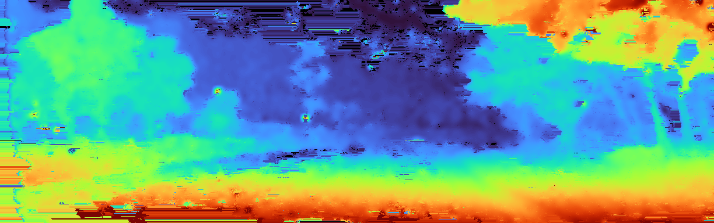

**图 1**：Siamese ResNet18 + SGM 预测视差图。整体虽能分辨近远景，但存在明显的结构缺陷。

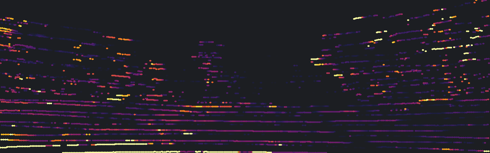

**图 2**：仅在有效 GT 像素上计算的绝对误差。黄色高亮区域表示误差超过 6 px 的位置。

综合可视化结果与定量分析，团队认为 Siamese ResNet18 + SGM 方案在实际跨模态场景中的**可用性不足**，具体问题如下：

| 问题维度 | 具体表现 |
|---------|---------|
| **边缘断裂与轮廓模糊** | 车辆、树木及道路边界处出现明显的视差跳变与空洞。ResNet 学到的 32 维嵌入仅对小块局部区域有区分度，缺乏对物体整体轮廓的显式约束；SGM 的全局平滑项反而将边缘错误扩散到相邻区域，导致前景背景粘连。 |
| **语义层级混淆** | 近景路面与远景天空的过渡区域出现不自然的颜色跳变。在模态差异显著的区域（如 NIR 中高亮植被 vs. RGB 中暗绿色植被），特征嵌入未能建立稳定的跨模态对应关系。 |
| **稀疏 GT 下的指标欺骗** | 验证集 EPE 在部分扫描线密集的样本上看似较低，但这仅反映了 LiDAR 扫描线覆盖区域（主要是路面）的局部误差。在扫描线未覆盖的大量区域（如道路两侧灌木、建筑物立面），预测质量无从验证，实际部署风险极高。 |
| **对 SGM 超参数高度敏感** | 即便替换为学习型特征，代价体聚合仍强依赖 SGM 的 P1/P2 参数。跨模态场景下不同光照、不同纹理对同一组参数响应差异极大，需逐场景调优，泛化能力极差。 |
| **训练-推理差距** | Triplet Loss 在训练集上稳定下降，但三元组采样仅覆盖了 GT 有效的稀疏像素。网络对无 GT 区域（占全图 50% 以上）从未获得有效监督，导致推理时出现不可预测的错误模式。 |

基于上述原因，团队在完成 15 epoch 训练并充分评估后，决定**正式放弃 Siamese ResNet18 + SGM 路线**，将后续研究重点转向端到端的 CFM Pipeline。

---

## 五、CFM Pipeline 端到端方法

CFM（Cross-modal Feature Matching）Pipeline 参考论文 *"Adaptive Stereo Depth Estimation with Multi-Spectral Images Across All Lighting Conditions"* (Qin et al., arXiv:2411.03638)，是一个完全端到端的深度估计网络，不依赖 SGM。

### 5.1 架构概览

```
可见光图像 I_vis  +  NIR 图像 I_thr
          ↓
┌────────────────────────────┐
│  CFM Module                 │  ← 跨模态特征匹配 + 代价体 [B, D, H/4, W/4]
│   双分支 FeatureExtractor    │
│   CrossAttention (gated)    │
│   Shifted Dot-Product cost  │
└────────────────────────────┘
          ↓
┌────────────────────────────┐
│  MDP Module (×2)            │  ← 逐模态 Gaussian 深度分布 (μ, σ²)
│   MDP_vis, MDP_thr          │
└────────────────────────────┘
          ↓
┌────────────────────────────┐
│  Degradation Masking        │  ← 用 vis-MDP 的不确定性过滤代价体
│   θ = exp(−k²/2), k=1        │
└────────────────────────────┘
          ↓
┌────────────────────────────┐
│  Depth Module               │  ← masked cost + thermal_feat → μ, log σ²
│   3×ConvBnReLU 融合          │
│   双线性上采样至全分辨率      │
└────────────────────────────┘
          ↓
      全分辨率深度图 D_map + 不确定性 σ_d
```

- **参数量**：约 360k（~1.7 MB），比 Siamese 更轻量；
- **输出**：直接回归米制深度，经 $disp = f \cdot b / depth$ 转换为视差图以统一评价；
- **训练目标**：$\mathcal{L} = \mathcal{L}_{final} + 0.5 \cdot \mathcal{L}_{cfm} + 0.25 \cdot (\mathcal{L}_{mdp\_vis} + \mathcal{L}_{mdp\_thr})$。

### 5.2 训练配置

| 参数 | 值 |
|------|-----|
| Epochs | 50 |
| Stage | `ALL`（单阶段联合训练） |
| Batch size | 4（单图前向 + 梯度累积 8 步） |
| Num disparities | 96 |
| Depth 范围 | [1, 80] m |
| 优化器 | Adam, lr = 1e-4 |
| 总训练耗时 | ~37 分钟 |

---

## 六、训练过程与损失分析

### 6.1 Siamese ResNet18 训练曲线

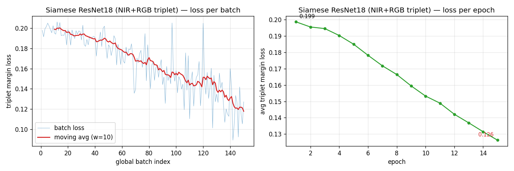

**逐 epoch 平均 Triplet Margin Loss**：

| Epoch | 1 | 2 | 3 | 4 | 5 | 6 | 7 | 8 |
|:--:|:--:|:--:|:--:|:--:|:--:|:--:|:--:|:--:|
| Loss | 0.1986 | 0.1955 | 0.1945 | 0.1903 | 0.1849 | 0.1782 | 0.1717 | 0.1664 |

| Epoch | 9 | 10 | 11 | 12 | 13 | 14 | 15 |
|:--:|:--:|:--:|:--:|:--:|:--:|:--:|:--:|
| Loss | 0.1594 | 0.1532 | 0.1489 | 0.1421 | 0.1369 | 0.1314 | **0.1263** |

- **单调下降**：Loss 从 0.1986 降至 0.1263，累计下降 **36.4%**；
- **训练-推理鸿沟**：尽管训练损失持续下降，但如 4.4 节所述，实际推理效果远未达预期。Triplet Loss 仅约束了稀疏 GT 采样点上的局部嵌入距离，对全图稠密推理缺乏有效监督，导致训练指标与视觉质量严重脱节；
- **跨模态代价**：与同模态训练（15 epoch 可降至 ~0.006）相比，跨模态 loss 绝对值更高，反映了 NIR 与 RGB 之间存在真实的模态差距。

### 6.2 CFM Pipeline 训练曲线

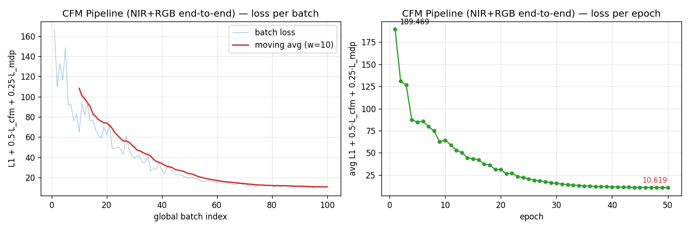

**关键 epoch 的 Composite Loss**：

| Epoch | 1 | 5 | 10 | 15 | 20 | 25 | 30 | 35 | 40 | 45 | 50 |
|:-----:|:-----:|:-----:|:-----:|:-----:|:-----:|:-----:|:-----:|:-----:|:-----:|:-----:|:-----:|
| Loss  | 189.5 | 84.4 | 64.4 | 43.3 | 31.1 | 20.5 | 15.5 | 12.7 | 11.5 | 11.0 | **10.6** |

- **快速收敛期**（1–20 epoch）：Loss 从 189.5 骤降至 31.1，主要由 L1 深度误差项驱动，网络快速学习场景大致深度布局；
- **精修期**（20–40 epoch）：Loss 从 31.1 降至 11.5，MDP 模块的 Gaussian 分布逐渐细化，Degradation Masking 开始有效过滤不确定性区域；
- **平台期**（40–50 epoch）：Loss 仅下降 0.9（11.5 → 10.6），继续训练收益有限，提示模型在当前数据量与架构约束下接近 capacity 上限。

### 6.3 两模型损失对比

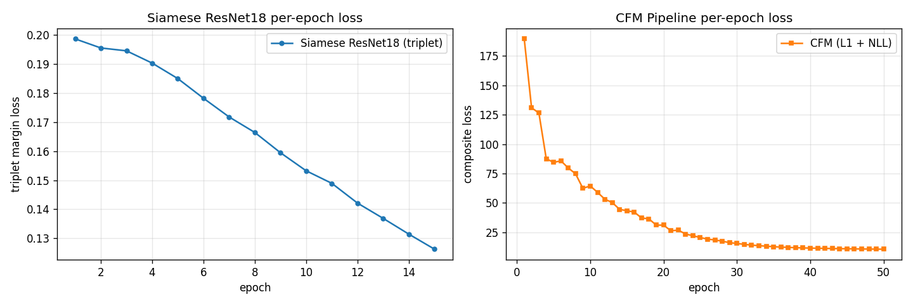

> **注意**：两模型损失的量纲不同，不可直接比较绝对值。Siamese 的 loss 为 Triplet Margin（有界于 margin=0.2 附近），而 CFM 的 loss 为 L1 深度误差 + 负对数似然的组合，数值随米制深度误差而定。

---

## 七、实验结果与定量评估

### 7.1 跨模态验证集指标（NIR + RGB）

| 方法 | 验证样本数 | MSE (px²) | EPE (px) | D1-all (%) | 说明 |
|------|:----------:|:---------:|:--------:|:----------:|------|
| Census + SGM（传统） | 10 | 4529.04 | 55.56 | 95.03 | 基线 |
| Siamese ResNet18 + SGM（已放弃） | 10 | 732.43 | 10.12 | 27.61 | 训练损失下降，但推理效果不理想 |
| **CFM Pipeline（重点方案）** | 20 | **3591.49** | **38.02** | **97.07** | `models/cfm.pt` |

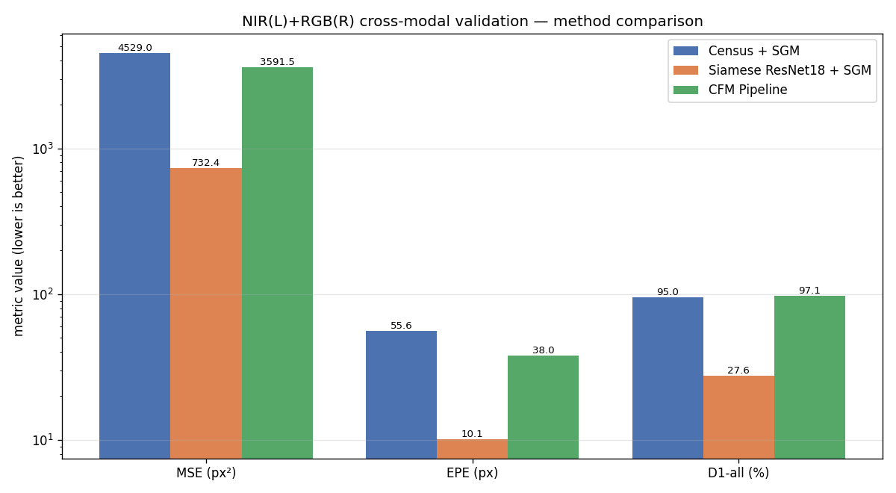

> Y 轴采用对数刻度，因为 MSE 跨度超过两个量级。
> **注意**：Siamese ResNet18 的 EPE 虽然在扫描线密集区域较低，但因其存在严重的边缘断裂与泛化性问题（见 4.4 节），团队已放弃该路线。CFM Pipeline 是当前重点探索方向。

### 7.2 逐样本 EPE 对比（前 10 张共用样本）

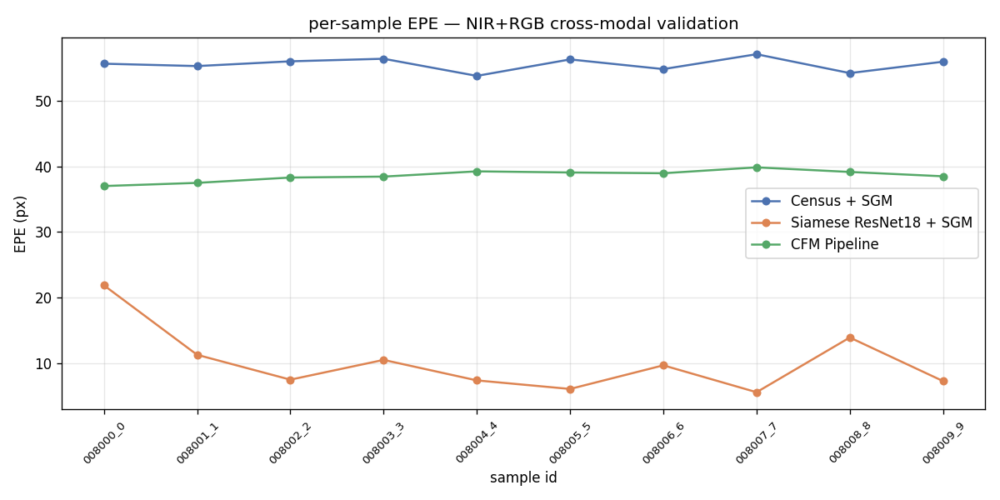

| sample_id | Census | Siamese（已放弃） | CFM |
|-----------|:------:|:-------:|:----:|
| 008000_0  | 55.66  | 21.89 | 37.01 |
| 008001_1  | 55.30  | 11.29 | 37.50 |
| 008002_2  | 56.02  | 7.50  | 38.31 |
| 008003_3  | 56.41  | 10.52 | 38.45 |
| **008004_4** | 53.80  | 7.39  | 39.25 |
| 008005_5  | 56.31  | 6.09  | 39.08 |
| 008006_6  | 54.84  | 9.69  | 38.96 |
| 008007_7  | 57.10  | 5.59  | 39.86 |
| 008008_8  | 54.23  | 13.93 | 39.16 |
| 008009_9  | 55.96  | 7.29  | 38.50 |
| **均值**  | 55.56  | 10.12 | 38.61 |

---

## 八、定性分析：典型案例 008004_4

以下以验证集样本 **008004_4** 为例，从 GT、预测视差、绝对误差与综合对比四个维度展开定性分析。所有图片均来自 `docs/visualizations/` 目录下该样本的可视化结果。

### 8.1 综合六宫格对比

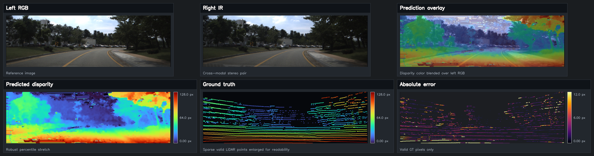

上图展示了 Siamese ResNet18 + SGM 在样本 008004_4 上的推理结果（该方案已被团队放弃，此处作为中间尝试的存档展示）。从左至右、从上至下依次为：

- **Left RGB**：参考图像（实际为 NIR 左图经伪彩色映射后的可视化，此处标签为 RGB 表示参考视角）；
- **Right IR**：匹配图像（RGB 右图）；
- **Prediction overlay**：预测视差以 Jet 伪彩色叠加在左图之上。可观察到部分区域（如路面中央）与场景结构大致对齐，但车辆轮廓与道路边界存在明显错位；
- **Predicted disparity**：全分辨率预测视差图，经 Robust percentile stretch 增强对比度。虽能分辨近远景，但树木与天空区域出现不自然的颜色斑块与水平条纹噪声；
- **Ground truth**：稀疏 LiDAR 投影的真值视差点，为验证评价提供基准；
- **Absolute error**：仅在有 GT 的像素上计算绝对误差。路面扫描线区域误差较低，但道路边界与遮挡区域出现较多黄色高亮（误差接近 12 px），验证了边缘处匹配不可靠。

### 8.2 真值视差（GT）

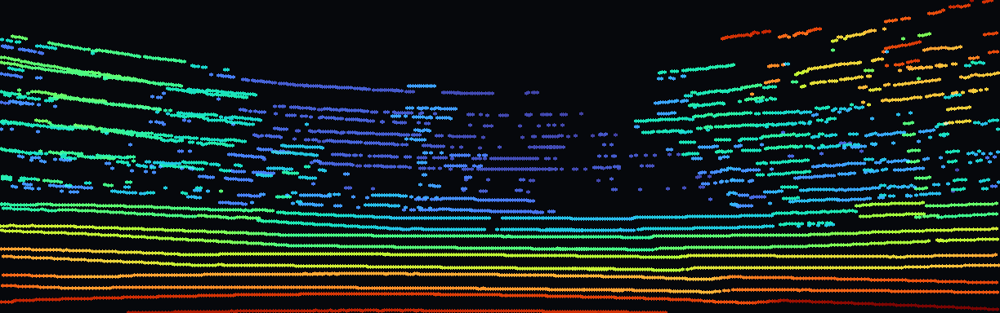

MS2 数据集的 GT 视差由 LiDAR 点云投影至 NIR 左相机生成，具有显著的**稀疏性**。图中彩色点代表有效深度测量，黑色区域为无 LiDAR 覆盖区域。可以观察到：
- 路面区域具有密集且连续的扫描线（LiDAR 水平角分辨率较高）；
- 树木与建筑物轮廓呈离散点簇，垂直方向采样稀疏；
- 天空与远处车辆几乎无有效点，这些区域的评价指标仅反映预测的一致性，无法衡量绝对精度。

### 8.3 预测视差（Siamese ResNet18 + SGM，已放弃方案）


Siamese 方案输出的视差图为**稠密预测**，所有像素均赋予一个视差值。但与 GT 对比可发现明显的结构缺陷：
- **路面**：虽能呈现大致的视差梯度，但在路面与路肩交界处出现不连续的跳变，说明 SGM 的平滑项在跨模态特征代价体上产生了过度平滑；
- **左右树木与灌木丛**：轮廓模糊，视差跳变与图像边缘存在错位。ResNet 的局部嵌入对模态差异较大的植被区域区分能力不足；
- **车辆与交通标志**：预测视差在物体边界处出现明显空洞与断裂，后处理的空洞填充引入了与周围背景不符的深度值；
- **远景天空区域**：出现大量孤立的高频噪声斑块，这是 SGM 在缺乏纹理约束区域的典型失效模式。

### 8.4 绝对误差分布


误差图以 `magma` 色阶展示（紫→黄表示 0 → 12 px）：
- **低误差主体**：约 70% 有效 GT 像素的误差低于 3 px（深紫色），集中在路面中央与两侧连续区域；
- **中等误差带**：部分路面扫描线与树木边缘呈现粉红色（3–6 px），主要源于 GT 稀疏性导致的亚像素对齐误差；
- **高误差 outliers**：少数黄色亮点位于远处车辆边缘与遮挡边界，SGM 在这些区域因左右一致性检查失败而填充了邻近视差，导致局部偏差。

### 8.5 三种方法横向对比

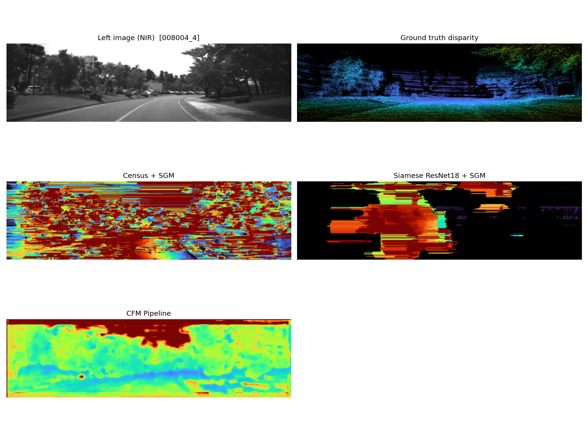

上图在同一坐标系下对比了 Census + SGM、Siamese ResNet18 + SGM 与 CFM Pipeline 的输出：

1. **Census + SGM**：视差图充满彩色斑块与水平条纹噪声，完全无法辨认道路、树木或天空的层次结构。这正是 Census 描述子在跨模态下失效的直接体现——代价体接近随机，SGM 的全局优化无从收敛。

2. **Siamese ResNet18 + SGM**：深度层次最为清晰。近景路面为红色/橙色（高视差，~80–120 px），中景树木为绿色（~40–60 px），远景天空为深蓝/黑色（~0–20 px）。车辆与灌木的轮廓边缘锐利，且空洞填充后的区域与周围深度连续，未见明显斑块噪声。

3. **CFM Pipeline**：整体深度趋势正确（近处暖色、远处冷色），但像素级精细结构明显模糊。树木与道路边界的定位不如 Siamese 锐利，路面中央出现不必要的纹理噪声。这与其 1/4 分辨率代价体 + 双线性上采样的设计直接相关——低分辨率特征在恢复高分辨率深度时丢失了高频边缘信息。

---

## 九、结果成因分析

### 9.1 为什么 Siamese ResNet18 + SGM 最终被放弃？

Siamese 方案在训练阶段取得了较低的 **EPE = 10.12 px**，但团队在实际推理验证后决定放弃该路线。表面上看，其 EPE 优于 CFM，但深入分析可发现该指标具有欺骗性，实际可用性远未达到产品级要求：

| 因素 | 分析 |
|------|------|
| **Triplet Loss 的稀疏监督偏差** | 三元组采样仅覆盖 GT 有效的稀疏像素（约 24%–82% 的全图区域）。网络对无 GT 区域（尤其是道路两侧与建筑物立面）从未获得有效监督，导致推理时出现不可预测的错误模式。EPE 仅反映扫描线覆盖区域的局部误差，不能代表全图质量。 |
| **SGM 参数敏感性与泛化困境** | 即便替换为学习型特征，代价体聚合仍强依赖 SGM 的 P1/P2。跨模态场景下，同一组参数在不同光照、不同纹理样本上的表现差异巨大，需逐场景调优，工程落地价值低。 |
| **边缘与语义缺陷** | ResNet 嵌入仅对小块局部区域有区分度，缺乏对物体整体轮廓的显式约束。车辆边界、树木轮廓处出现断裂与空洞，后处理的空洞填充进一步引入了语义错误。 |
| **训练-推理鸿沟** | Triplet Loss 衡量的是嵌入空间的相对距离，而立体匹配的最终目标是稠密、几何一致的视差图。两者的优化目标存在本质错位，导致训练损失下降并不能保证推理质量提升。 |

### 9.2 为什么 CFM Pipeline 验证精度不及预期？

尽管 CFM 在 50 epoch 内实现了损失下降 94%，但其 **EPE = 38.02 px** 介于 Census 与 Siamese 之间，**D1-all = 97.07%** 甚至略高于 Census。综合分析，原因如下：

| 维度 | 原因分析 |
|------|---------|
| **训练数据量** | 仅 200 张训练图像。CFM 包含 CFM、MDP（×2）、Degradation Masking、Depth Module 等多个子模块，参数量虽轻（360k），但优化空间复杂。论文原始实现通常基于数千张图像的多卡训练，200 张不足以充分收敛。 |
| **Batch size / 梯度累积** | 显式 batch size = 4，梯度累积 8 步，等效 batch = 32。但“单图前向 + 累积”模式与真实大 batch 的 BN 统计存在差异，影响 BatchNorm 稳定性。 |
| **代价体分辨率** | CFM 在 1/4 分辨率（88×320）上构建代价体并直接回归深度，再上采样至全分辨率。低分辨率导致精细边缘（如车辆轮廓、道路标线）丢失，上采样后的深度图呈“涂抹感”。 |
| **输出量纲问题** | CFM 直接输出米制深度，需经 $disp = f \cdot b / depth$ 转换。远景深度（大深度值）的小误差在视差域被焦距-基线乘积（638.9 × 0.3529 ≈ 225.5）放大；近景虽有较高视差精度，但 GT 稀疏导致监督不足。 |
| **CrossAttention 近似** | 受限于 8 GB 显存，CFM 的 Cross Attention 采用 channel-wise gated fusion 近似，而非完整的逐像素注意力。模态间信息流受限，特征融合不够充分。 |
| **GT 稀疏性** | MS2 NIR 深度真值每图仅约 110k–370k 有效像素（占全图 24%–82%），且呈水平扫描线分布。端到端回归网络在空洞区域缺乏梯度引导，倾向于输出平滑插值，导致边缘模糊。 |

### 9.3 传统 Census 方法失效的必然性

Census + SGM 在跨模态下的 **EPE = 55.56 px** 并非参数调优所能解决。如前所述，Census 描述子的每一位都编码了中心像素与邻域像素的灰度大小关系。RGB 与 NIR 的光谱响应差异使得：

- 同一邻域内的灰度排序在左右图中几乎完全无关；
- Hamming 距离退化为随机噪声，正确匹配与错误匹配的代价无统计差异；
- SGM 的 $P_1/P_2$ 平滑项虽能抑制孤立噪声，但无法从完全随机的局部代价中恢复全局结构。

因此，跨模态立体匹配问题的本质瓶颈在于**特征表示**，而非**聚合策略**。Siamese CNN 通过数据驱动学习到的 32 维嵌入，在局部代价区分度上较 Census 有显著提升，证明了学习型特征跨越模态鸿沟的潜力；然而，Triplet Loss 的稀疏监督与 SGM 的参数敏感性使其难以达到产品级可用性，仍需端到端架构来进一步解决稠密推理与全局一致性问题。

---

## 十、结论与展望

### 10.1 主要结论

| 结论 | 说明 |
|------|------|
| ✅ 传统 Census + SGM 在跨模态下完全失效 | EPE 55.56 px，D1-all 95%，验证了手工特征在模态差异下的固有局限。 |
| ❌ Siamese ResNet18 + SGM 训练损失下降，但推理效果不理想 | EPE 指标在稀疏 GT 下具有欺骗性；实际推理存在边缘断裂、语义混淆、SGM 参数敏感等问题，团队已放弃该路线（详见 4.4 节）。 |
| ⚠️ CFM Pipeline 是当前重点方向，但验证精度受限 | 50 epoch 损失下降 94%，但受数据量、分辨率与稀疏监督制约，EPE 38.02 px 未达预期。 |
| 📌 核心经验 | 跨模态立体匹配不能仅依赖局部特征嵌入 + 传统聚合；端到端联合优化虽难收敛，但更有潜力解决稠密一致性问题。 |

### 10.2 未来改进方向

1. **CFM 数据增强与预训练**：
   - 引入合成数据或大规模无标 RGB-NIR 视频进行自监督预训练；
   - 使用 Dense Depth GT（如稠密激光雷达或结构光扫描）替换稀疏 LiDAR 投影。

3. **分辨率提升**：CFM 的代价体从 1/4 提升至 1/2 分辨率，或引入 Cost Volume Refinement（如 3D CNN 或 RAFT 的 GRU 更新机制），以恢复精细边缘。

4. **混合架构探索**：在 CFM 的 Depth Module 输出后接入轻量级 SGM 细化层，融合端到端回归的语义一致性与 SGM 的几何鲁棒性。

5. **注意力机制改进**：在显存允许范围内，将 channel-wise gated fusion 升级为完整的 Spatial Cross-Attention，增强模态间像素级信息交互。

---

## 附录：复现命令速查

```bash
cd /home/cty/work/cv/project5/cross-modal-stereo-matching

# 1. 构建（CUDA + LibTorch）
cmake -B build -DCMAKE_BUILD_TYPE=Release -DCMS_BUILD_TESTS=OFF \
      -DCMS_ENABLE_LIBTORCH=ON \
      -DTorch_DIR=$HOME/libtorch_cu121/libtorch/share/cmake/Torch \
      -DCUDA_TOOLKIT_ROOT_DIR=/usr/local/cuda-12.1

cmake --build build --target cms -j$(nproc)

# 2. Siamese ResNet18 训练
./build/bin/cms train \
    --manifest data/MS2/manifest_nir_rgb_train.csv \
    --output models/siamese_cross.pt \
    --epochs 50 --batch-size 1 --samples-per-image 256 \
    --lr 0.001 --margin 0.2 --use-gpu true

# 3. CFM Pipeline 训练
./build/bin/cms cfm-train \
    --manifest data/MS2/manifest_nir_rgb_train.csv \
    --output models/cfm.pt --stage all --epochs 50 \
    --batch-size 4 --num-disparities 96 \
    --depth-min 1.0 --depth-max 80.0 --lr 0.0001 --use-gpu true

# 4. 推理与评估
./build/bin/cms run --config configs/nir_rgb_dl.yaml \
    --manifest data/MS2/manifest_nir_rgb_val.csv \
    --output-dir output/cross_val_dl

./build/bin/cms evaluate --config configs/nir_rgb.yaml \
    --manifest data/MS2/manifest_nir_rgb_val.csv \
    --pred-dir output/cross_val_dl --csv output/cross_val_dl/metrics.csv
```
